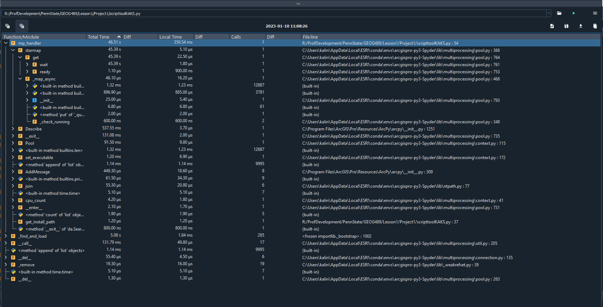

# Lesson 1, Project 1.2:  Python Coding and Profiling
### Kalin AK Seaton

## Step 2: Add Code Profiling

To measure the duration of different processes, I added variations of the simple timer from Lesson 1.6. 
I sprinkled in several benchmarks:

1. **process_start_time** starts the clock
2. **mpStart** at the beginning of the mp_handler function
3. **poolTime** grabs time after pool is set up but before multiprocessor executes
4. **mpFinish** at the end of the mp_handler function's actual work, but before timer outputs print

When the script executes, it produces several durations based on subtracting these benchmarks
- Run click to beginning of if statement execution
- mp_handler through pool set up, which includes speed of the get_install_path function
- mp_handler multiprocessing 
- total mp_handler
- total run time

Here's the output from running the simple timer:

```python
#    --- 0.0 seconds --- to start of mp_handler.
#    Creating Polygon OID list...
#    There are 51 object IDs (polygons) to process.
#    Job list has 51 elements.
#    Sending to pool
#    there are: 16 cpu cores on this machine
#    Finished multiprocessing!
#    --- 0.13802313804626465 seconds --- pool set up
#    --- 39.847713232040405 seconds --- multiprocessing
#    --- 39.98573637008667 seconds --- mp_handler
#    --- 39.98573637008667 seconds --- total run time

```    

### Analysis of Step 2:
- The majority of program processing time (46 - 55 sec) is during the multiprocessing,with an additional ~5 seconds on start up if arcpy is loaded for the first time. 
- When I run the code from Jupyter using the simple timer, I get:
    - 4-5 seconds to load modules (this is largely loading arcpy)
    - < 0.2 seconds from start of mp_handler through calculation of cpu cores.
    - 45-47 seconds for the multiprocessor to execute (rest of mp_handler)
- When I run the profiler in Spyder, I get very similar values:
    - about 5 seconds to load the modules (find_and_load, mostly arcpy load time)
    - about 47 seconds for the mp_handler to run
Here's the screenshot of the profiler output in Spyder:


### Job 2: further examination of performance
Just for fun, I limited the number of processors to **8** (commented out in code above) and ran it again:
- < 0.2 seconds from start of mp_handler through calc of cpu cores (same as usual)
- about 33 seconds for the mp_handler to run

Wait- using **FEWER** processors seemed to speed up the mp_handler, so I tried it again. Yep. 33 seconds for the multiprocessing. I switch the code back to letting it use all 16 processors, and it used 46 seconds. SO, launching all the python windows might be costing some time. 
I ran it again with **4** processors to see what would happen. The speed inched up to 34 seconds, which is still better performance than running all 16.
I ran it again with **2** processors. The speed increased to ~ 40 seconds.
I modified the code (as little as possible) to run it without the multiprocessing (see below). The speed for the analysis itself, the clipping, was ~ 64 seconds. So, on this relatively small job, the multiprocessing makes a difference and I would expect that increasing the number of elements tenfold would start to show differences as the processing time climbs past that intitial set up of 16 different python instances, etc. 
Fun.

### Results when multiprocessing removed

```python
#    --- 4.2310950756073 seconds --- to start of clipping.
#    Creating Polygon OID list...
#    There are 51 object IDs (polygons) to process.
#    Job list has 51 elements.
#    Finished clipping!
#    --- 64.84112620353699 seconds --- clipping time
#    --- 69.07222127914429 seconds --- total run time
```    
